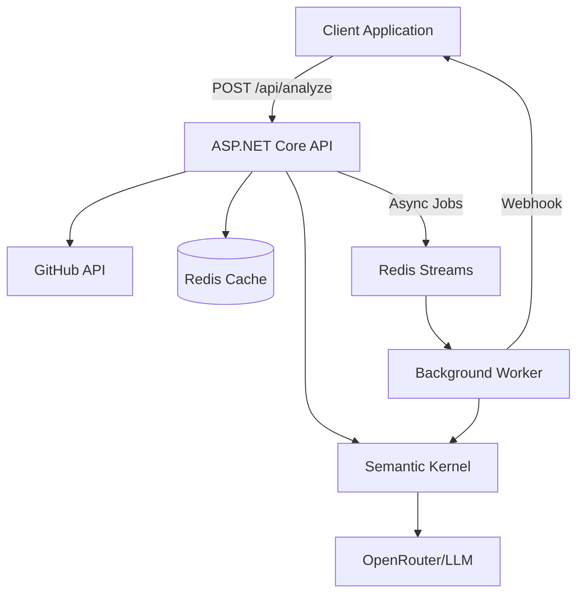

# Pull Request Analyzer

A production-ready Pull Request analysis service that uses AI to understand what was **actually implemented** vs what was **claimed** in pull requests, helping engineering leaders reduce miscommunication and ensure code changes align with intended features.

## 🎯 Core Value Proposition

This tool provides structured, evidence-based analysis of pull request changes by:
- Analyzing actual code diffs (not just commit messages)
- Requiring evidence citations for every claim
- Providing confidence levels with explicit rationale
- Detecting discrepancies between PR descriptions and implementation

## 🏗️ Architecture



## 🚀 Quick Start

### Prerequisites
- Docker & Docker Compose
- .NET 8.0 SDK
- GitHub Personal Access Token
- OpenRouter API Key

### Environment Setup

Create a `.env` file:
```bash
GITHUB_TOKEN=your_github_token
OPENROUTER_API_KEY=your_openrouter_key
OPENROUTER_MODEL=google/gemini-2.0-flash-exp:free
REDIS_URL=localhost:6379
```

### Running the Application

```bash
# Start all services
make dev

# Or manually with Docker Compose
docker-compose up --build

# Access the API
curl http://localhost:5000/health
```

### API Documentation
Swagger UI available at: http://localhost:5000/swagger

## 📋 API Endpoints

### Core Endpoints (Required by Specification)

| Endpoint | Method | Description |
|----------|--------|-------------|
| `/api/pull-requests/:owner/:repo/:number` | GET | Fetch normalized PR data from GitHub |
| `/api/pull-requests/:owner/:repo/:number/commits` | GET | Get PR commits |
| `/api/analyze` | POST | Analyze PR (sync or async with webhook) |

### Additional Endpoints

| Endpoint | Method | Description |
|----------|--------|-------------|
| `/api/v2/analyze-async` | POST | Submit PR for async analysis |
| `/api/v2/jobs/:jobId` | GET | Check job status |
| `/api/v2/jobs` | GET | List all jobs |
| `/health` | GET | Health check |
| `/info` | GET | System information |

## 🧠 AI Analysis Features

### Grounding & Anti-Hallucination

The system implements multiple layers to prevent LLM hallucinations:

1. **Evidence-Based Claims**: Every analysis must cite specific lines from diffs
2. **File Validation**: Verifies all referenced files exist in the PR
3. **Confidence Levels**:
   - `HIGH`: Direct evidence in diff
   - `MEDIUM`: Inferred from context
   - `LOW`: Assumption based on conventions

### Analysis Output Structure

```json
{
  "executive_summary": ["Key changes in 2-6 bullets"],
  "change_units": [
    {
      "type": "feature|bugfix|refactor|test|docs",
      "title": "Short descriptive title",
      "description": "What changed",
      "inferred_intent": "Why it likely changed",
      "confidence_level": "high|medium|low",
      "evidence": "Exact quote from diff",
      "rationale": "Explanation for confidence",
      "affected_files": ["file paths"],
      "test_coverage_signal": "tests_added|tests_modified|no_tests"
    }
  ],
  "risks_and_concerns": ["List of identified risks"],
  "claimed_vs_actual": {
    "alignment_assessment": "aligned|partially_aligned|misaligned",
    "discrepancies": ["List of discrepancies"]
  }
}
```

## 🛠️ Technology Stack

### Core Technologies
- **Framework**: ASP.NET Core 8.0
- **AI Orchestration**: Microsoft Semantic Kernel 1.29.0
- **LLM Provider**: OpenRouter (supports multiple models)
- **Cache & Queue**: Redis with StackExchange.Redis
- **GitHub Integration**: Octokit 14.0.0
- **API Documentation**: Swashbuckle/Swagger

### Key Design Decisions

1. **Semantic Kernel over raw HTTP**: Production-ready AI orchestration with type safety
2. **Hybrid Confidence Approach**: Qualitative labels + explicit rationale for transparency
3. **Embedded Diffs**: All analysis data in one place (no additional API calls during analysis)
4. **Redis for Everything**: Cache, job queue, and distributed locking

## 📁 Project Structure

```
pull-request-analyzer/
├── Controllers/
│   ├── AnalyzeController.cs        # Main analysis endpoint
│   ├── AsyncAnalysisController.cs  # Async job management
│   └── PullRequestController.cs    # GitHub data fetching
├── Models/
│   ├── AnalysisResult.cs          # Analysis output models
│   ├── PullRequestData.cs         # GitHub PR models
│   └── PrIdentifier.cs            # PR identification
├── Services/
│   ├── SemanticKernelAnalysisService.cs  # AI analysis with SK
│   ├── GitHubIngestService.cs           # GitHub API integration
│   ├── RedisCacheService.cs             # Caching layer
│   ├── RedisJobQueue.cs                 # Async job queue
│   ├── RedisBackgroundWorker.cs         # Job processor
│   └── WebhookService.cs                # Webhook notifications
├── Messages/
│   ├── AnalyzePullRequestCommand.cs     # Job commands
│   └── Events.cs                        # Domain events
└── Program.cs                           # Application entry point
```

## 🔄 Synchronous vs Asynchronous Analysis

### Synchronous Mode (Default)
```bash
curl -X POST http://localhost:5000/api/analyze \
  -H "Content-Type: application/json" \
  -d '{"pull_request_data": {...}}'
```
- Best for small PRs (<10 files)
- Immediate response
- Request timeout: 120 seconds

### Asynchronous Mode (With Webhook)
```bash
curl -X POST http://localhost:5000/api/analyze \
  -H "Content-Type: application/json" \
  -d '{
    "pull_request_data": {...},
    "webhook_url": "https://your-webhook.com/callback"
  }'
```
- Best for large PRs
- Returns job ID immediately
- Results sent to webhook when complete

## 🧪 Testing

Run the test suite:
```bash
# Test all endpoints
bash test-api.sh

# Or test individual endpoints
curl http://localhost:5000/api/pull-requests/mindsdb/mindsdb/12248 | jq '.'
```

## 📊 Caching Strategy

| Cache Type | TTL | Purpose |
|------------|-----|---------|
| PR Data | 1 hour | GitHub API responses |
| Analysis Results | 24 hours | LLM analysis results |
| Jobs | 7 days | Async job history |

## 🔐 Security Considerations

- GitHub token required for API access
- OpenRouter API key for LLM access
- Redis password protection recommended for production
- Webhook URLs validated before sending results
- No storage of sensitive code content beyond cache TTL

## 🚢 Production Deployment

### Docker Deployment
```bash
docker build -t pr-analyzer .
docker run -p 5000:5000 \
  -e GITHUB_TOKEN=$GITHUB_TOKEN \
  -e OPENROUTER_API_KEY=$OPENROUTER_API_KEY \
  -e REDIS_URL=$REDIS_URL \
  pr-analyzer
```

### Environment Variables
| Variable | Description | Default |
|----------|-------------|---------|
| `GITHUB_TOKEN` | GitHub API access token | Required |
| `OPENROUTER_API_KEY` | OpenRouter API key | Required |
| `OPENROUTER_MODEL` | LLM model to use | `google/gemini-2.0-flash-exp:free` |
| `REDIS_URL` | Redis connection string | `localhost:6379` |
| `ASPNETCORE_ENVIRONMENT` | Runtime environment | `Development` |

## 📈 Performance Characteristics

- **Small PRs (<10 files)**: 5-15 seconds
- **Medium PRs (10-50 files)**: 15-45 seconds
- **Large PRs (>50 files)**: Use async mode
- **Cache hit**: <100ms response time
- **Concurrent jobs**: Limited by Redis connections and LLM rate limits

## 🤝 Contributing

1. Fork the repository
2. Create a feature branch
3. Make your changes
4. Add tests if applicable
5. Submit a pull request

## 📄 License

MIT License - See LICENSE file for details

## 🆘 Support

- **Issues**: [GitHub Issues](https://github.com/devleor/pull-request-analyzer/issues)
- **Documentation**: This README and inline code documentation
- **API Docs**: http://localhost:5000/swagger when running

## 🎓 Acknowledgments

Built as a take-home assignment demonstrating production-ready AI integration with a focus on accuracy, explainability, and prevention of LLM hallucinations.